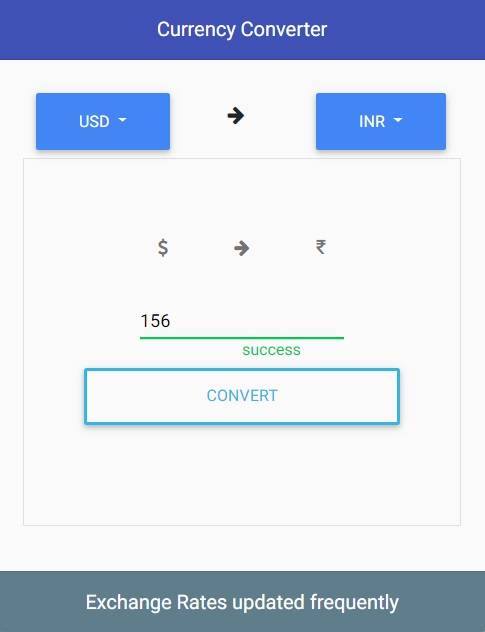
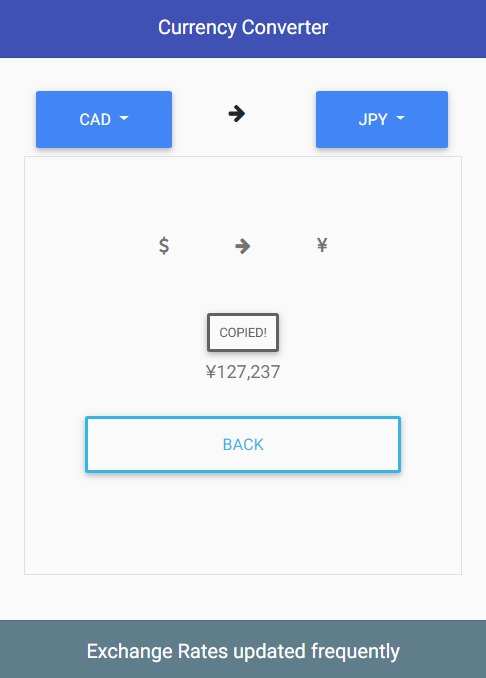
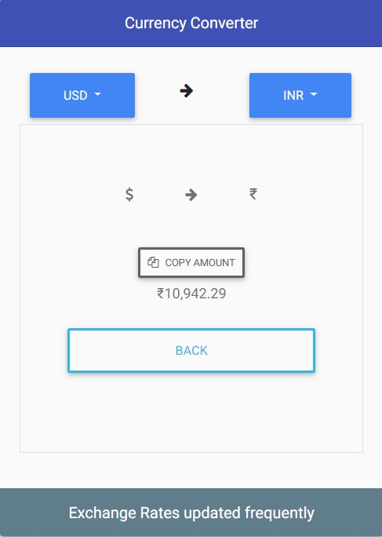
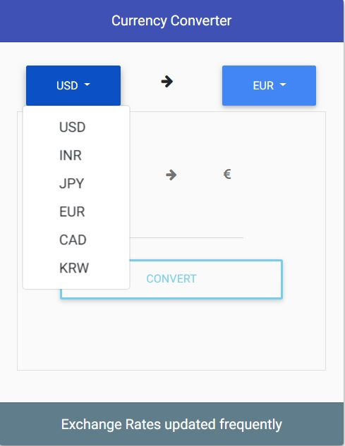
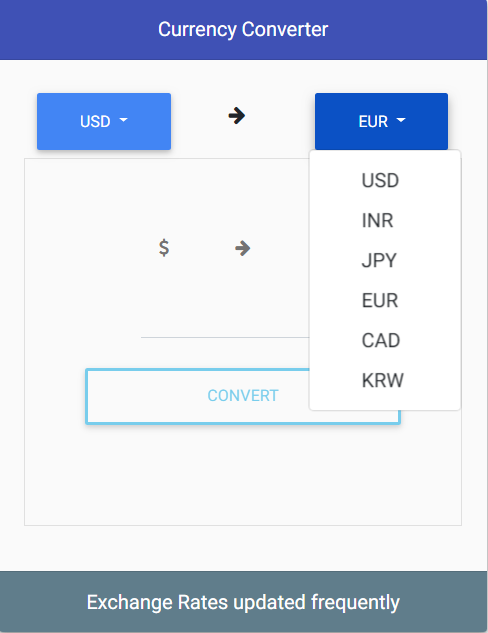

# Currency Converter
Currency Converter App based on angular 6 with Material Bootstrap.





## Demo
You may want to have a look at the demo: https://vgupta1192.github.io/currency-demo/

## Adding the component in your project
```
<app-currency-converter></app-currency-converter>
```
### Dependencies
```
npm install --save angular-bootstrap-md
npm install --save font-awesome
npm install --save hammerjs
npm install --save chart.js@2.5.0
```

### App Details
```
App can be used to convert different currencies like dollar to Indian Rupees and Indian Rupees to European Pound and a few other currencies etc. in a web application.
User also has the option to directly copy the converted currency into the clipboard.
```

### Services
```
The service call for getting the current currency rate for different currencies.

1. currency.service.ts
```
### currency.service.ts
```typescript
import { Injectable } from '@angular/core';
import { HttpClient} from '@angular/common/http';
import { Currency } from './currency.model';
import { Observable } from 'rxjs';

@Injectable({
    providedIn: 'root'
})
export class CurrencyService {
    constructor(private httpClient: HttpClient) {}

    /* To get the current currency exchange rates based on the base provided for the given 'toCurrency' */
    getCurrency(fromCurrency: string, toCurrency: string): Observable<Currency> {
        return this.httpClient.get<Currency>('https://ratesapi.io/api/latest?base=' + fromCurrency + '&symbols=' + toCurrency);
    }
}


```
### Model
```

1. currency.model.ts
```
### currency.model.ts
``` typescript
export interface Currency {
    rates:
    {
        INR,
        USD,
        JPY,
        EUR,
        CAD,
        KRW
    };
}

```
### currency-converter.component.html
``` html
<div class="container">
  <div class="row">
    <div class="col- mx-auto converter-currency">
      <mdb-card class="text-center">
        <mdb-card-header class="indigo text-white">Currency Converter</mdb-card-header>
        <mdb-card-body style="background-color:#fafafa">
          <mdb-card-title>
            <div class="row">
                <div class="col-5">
                    <div class="dropdown" mdbDropdown>
                        <button mdbDropdownToggle mdbBtn color="primary" class="dropdown-toggle waves-light" type="button"
                          mdbWavesEffect>
                          {{fromDropdownName}}
                        </button>
                        <div class="dropdown-menu dropdown-primary">
                          <button class="dropdown-item" *ngFor="let conversion of conversions" (click)="conversionFromChange(conversion.id,conversion.name)">{{conversion.name}}</button>
                        </div>
                      </div>
                </div>
                <div class="col-2">
                    <i class="fa fa-arrow-right w-25 p-3 align-arrow" aria-hidden="true"></i>
                </div>
                <div class="col-5">
                    <div class="dropdown" mdbDropdown>
                        <button mdbDropdownToggle mdbBtn color="primary" class="dropdown-toggle waves-light" type="button"
                          mdbWavesEffect>
                          {{toDropdownName}}
                        </button>
                        <div class="dropdown-menu dropdown-primary">
                          <button class="dropdown-item" *ngFor="let conversion of conversions" (click)="conversionToChange(conversion.id,conversion.name)">{{conversion.name}}</button>
                        </div>
                      </div>
                </div>
          </div>
          </mdb-card-title>
          <mdb-card-text>
            <form class="text-center border border-light p-5" #conversionForm="ngForm">

                <i class="fa w-25 p-3" aria-hidden="true"
                [ngClass]="fromDropdownName === 'USD' || fromDropdownName === 'CAD' ? 'fa-dollar' : fromDropdownName === 'INR' ? 'fa-rupee' : 
                fromDropdownName === 'EUR' ? 'fa-euro' : fromDropdownName === 'JPY' ? 'fa-yen' : 'fa-krw'"></i>
                <i class="fa fa-arrow-right w-25 p-3" aria-hidden="true"></i>
                <i class="fa w-25 p-3" aria-hidden="true"
                [ngClass]="toDropdownName === 'USD' || toDropdownName === 'CAD' ? 'fa-dollar' : toDropdownName === 'INR' ? 'fa-rupee' : 
                toDropdownName === 'EUR' ? 'fa-euro' : toDropdownName === 'JPY' ? 'fa-yen' : 'fa-krw'"></i>
                <div class="md-form wow fadeInUp" *ngIf="showConfirm">
                  <input mdbInputDirective type="number" id="currencyId" [(ngModel)]="amount" name="currencyInput"
                    required >
                  <button mdbBtn type="button" color="info" block="true" outline="true" (click)="convertCurrency()"
                    [disabled]="!conversionForm.valid" mdbWavesEffect>Convert</button>
                </div>
                <div class="md-form wow fadeInUp" data-wow-delay="0.6s" *ngIf="!showConfirm">
                    <button class="btn-copy-code btn btn-outline-grey btn-sm px-2 waves-effect" (click)="copyMessage()">
                      <i class="fa fa-copy mr-1" *ngIf="copyLabel === 'Copy Amount'"></i> {{copyLabel}}
                    </button>
                  <mdb-card-text *ngIf="toDropdownName === 'USD'">{{convertedAmount | currency:'USD'}}</mdb-card-text>
                  <mdb-card-text *ngIf="toDropdownName === 'INR'">{{convertedAmount | currency:'INR'}}</mdb-card-text>
                  <mdb-card-text *ngIf="toDropdownName === 'EUR'">{{convertedAmount | currency:'EUR'}}</mdb-card-text>
                  <mdb-card-text *ngIf="toDropdownName === 'JPY'">{{convertedAmount | currency:'JPY'}}</mdb-card-text>
                  <mdb-card-text *ngIf="toDropdownName === 'CAD'">{{convertedAmount | currency:'CAD'}}</mdb-card-text>
                  <mdb-card-text *ngIf="toDropdownName === 'KRW'">{{convertedAmount | currency:'KRW'}}</mdb-card-text>
                  <button mdbBtn type="button" color="info" block="true" outline="true" (click)="showConfirm=!showConfirm"
                    mdbWavesEffect>Back</button>
              </div>

            </form>
          </mdb-card-text>
        </mdb-card-body>
        <mdb-card-footer class="blue-grey text-white">Exchange Rates updated frequently</mdb-card-footer>
      </mdb-card>
    </div>
  </div>
</div>

```
### currency-converter.component.ts
``` typescript
import { Component, OnInit } from '@angular/core';
import { CurrencyService } from './currency.service';

@Component({
  selector: 'app-currency-converter',
  templateUrl: './currency-converter.component.html',
  styleUrls: ['./currency-converter.component.scss']
})
export class CurrencyConverterComponent implements OnInit {
  amount: any;
  convertedAmount: number;
  copyLabel: string;
  index: number;
  dropdownName: string;
  showConfirm: boolean;
  conversions = [
    {
      id: 1,
      name: 'USD'
    },
    {
      id: 2,
      name: 'INR'
    },
    {
      id: 3,
      name: 'JPY'
    },
    {
      id: 4,
      name: 'EUR'
    },
    {
      id: 5,
      name: 'CAD'
    },
    {
      id: 6,
      name: 'KRW'
    }
  ];
  fromDropdownName: string;
  toDropdownName: string;

  constructor(private currencyService: CurrencyService) {}

  ngOnInit() {
    this.showConfirm = true;
    this.index = 1;
    this.fromDropdownName = 'USD';
    this.toDropdownName = 'INR';
    this.copyLabel = 'Copy Amount';
  }

  /* Method will run when a user click on the currency dropdown from which the user has to convert  */
  conversionFromChange(id: number, conversionName: string) {
    this.resetConversion();
    this.fromDropdownName = conversionName;
  }

  /* Method will run when a user click on the currency dropdown to which the user has to convert  */
  conversionToChange(id: number, conversionName: string) {
    this.resetConversion();
    this.toDropdownName = conversionName;
  }

   /* Method will run when a user click on the 'Convert' button to convert the currency entered */
  convertCurrency() {
    this.copyLabel = 'Copy Amount';
    this.currencyService.getCurrency(this.fromDropdownName, this.toDropdownName).subscribe(response => {
      if (this.toDropdownName === 'USD') {
        this.convertedCurrency(response.rates.USD);
      } else if (this.toDropdownName === 'INR') {
        this.convertedCurrency(response.rates.INR);
      } else if (this.toDropdownName === 'EUR') {
        this.convertedCurrency(response.rates.EUR);
      } else if (this.toDropdownName === 'JPY') {
        this.convertedCurrency(response.rates.JPY);
      } else if (this.toDropdownName === 'CAD') {
        this.convertedCurrency(response.rates.CAD);
      } else {
        this.convertedCurrency(response.rates.KRW);
      }
    });
  }

   /* Method will run to calculate the logic for the conversion*/
  convertedCurrency(response: any) {
    if (response === undefined) {
      response = 1;
    }
    this.convertedAmount = this.amount * response;
    this.showConfirm = false;
  }

  /* Method will run to reset the currency converter app on every dropdown selection*/
  resetConversion() {
    this.showConfirm = true;
    this.amount = '';
    this.copyLabel = 'Copy Amount';
  }

  /* Method will run to copy the converted currency to clipboard*/
  copyMessage() {
    this.copyLabel = 'Copied!';
    const selBox = document.createElement('textarea');
    selBox.style.position = 'fixed';
    selBox.style.left = '0';
    selBox.style.top = '0';
    selBox.style.opacity = '0';
    selBox.value = this.convertedAmount.toFixed(2);
    document.body.appendChild(selBox);
    selBox.focus();
    selBox.select();
    document.execCommand('copy');
    document.body.removeChild(selBox);
  }
}


```

### currency-converter.component.scss
``` 
.dropdown-menu {
    min-width:95%;
}

.dropdown .dropdown-menu .dropdown-item {
    margin-left: 17px;
}

.dropdown .dropdown-menu .dropdown-item:hover {
    width: 5em !important;
}

.text-white {
    color: #fff;
}

.converter-currency {
    width: 391px;
}

.align-arrow {
    margin-left: -23px;
}

```